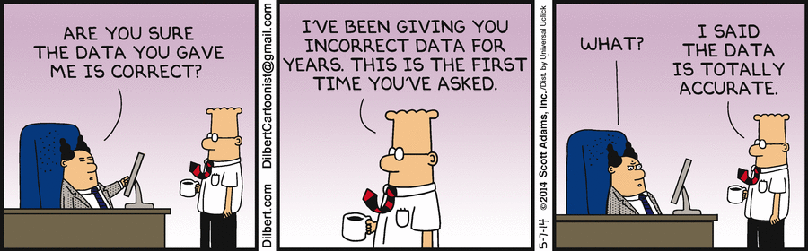
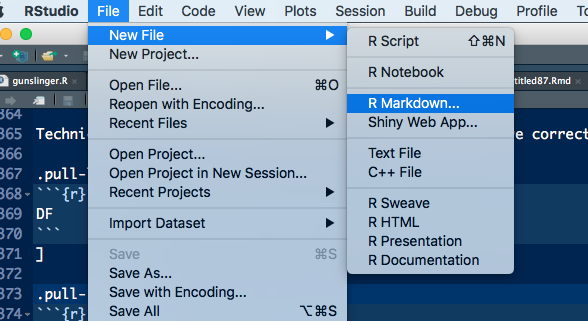

```{r setup, include=FALSE}
library(knitr)
options(htmltools.dir.version = FALSE, cache=TRUE)
opts_chunk$set(comment = NA, prompt=TRUE)
#opts_chunk$set(dev.args=list(bg="transparent"), fig.width=15, fig.height=7)
source("kutheme.R")
```

background-image: url(pics/redcard+sociology.jpg)
background-size: 96%
class: center, middle

???

Science og statistics har været under pres de seneste år.

Specielt indenfor psykologi har det vist sig svært at replikere vigtige resultater

Resulteret i en diskussion om, hvad videnserfaring var, og hvordan forskellige grupper 
kan se så forskelligt på de samme data. 

---

background-image: url(pics/soccer.png)
background-size: 98%
class: center, middle

???

Soccer la la la la

Rødt kort til farvede spillere

29 forskergrupper

---

# Classical research process

From idea ...

```{r echo=FALSE, messages=FALSE, warning=FALSE, out.width='100%', out.height='35%'}
library(DiagrammeR)
library(DiagrammeRsvg)
library(svglite)
library(rsvg)

#svg <- export_svg(
grViz("
digraph dot {

graph [layout = dot,
       rankdir = LR,
       bgcolor='#000000',
       size=2]

node [shape = circle,
      style = filled,
      fillcolor = DimGray,
      fontcolor = White,
      fontsize=15,
      fontname=Helvetica,
      label = '', 
      penwidth=4, 
      margin=0.05,
      color=White]
a [label='Design']
b [label='Collect']
c [label='Analyze']
d [label='Publish']

edge [color = White, penwidth=4]
a -> b -> c 
c -> d [color=red, penwidth=4]
}")
#)

#svg %>%
#  charToRaw %>% rsvg %>% png::writePNG('graph.png')
#knitr::include_graphics("graph.png")


# html_print(HTML(svg), background="transparent", viewer=NULL)

```


.pull-right[... to publication.]


???


The red line shows where peer review comes in. Total summary. We need to document the steps we did througout as shown in the soccer example.

We want reproducible research

---

# Why is reproducible research important?


> **Statistical analysis**
>
> .large[All of the data were analyzed with data processing software and figures with Microsoft excel 2007.]
>
> .pull-right[-- Tayefe *et al*, Advances in Bioresearch, 2014]

???

Full statistical analysis section from a scientific paper.

Clearly impossible to reproduce

---

# Terminology

**Reproducibility**

Given code/data/materials, can I get *the same* (=identical) numbers that you did?

**Replicability**

Given scientific protocol, can I get *the same* (=in agreement) result that you did in my own study?

???


However, what do we really do?


---

## The life of a data scientist

> .large[Data scientists, according to interviews and expert estimates, spend from **50 percent to 80 percent** of their time mired in this more mundane labor of collecting and preparing unruly digital data, before it can be explored for useful nuggets.]
>
> .right[.small[-- "For Big-Data Scientists, 'Janitor Work' Is Key Hurdle to Insight" - The New York Times, 2014]]

???

Noter


---

## Realistic process plan


```{r echo=FALSE, messages=FALSE, warning=FALSE, out.width='100%', out.height='25%'}
library(DiagrammeR)
library(DiagrammeRsvg)
library(svglite)
library(rsvg)

#svg <- export_svg(
grViz("
digraph dot {

graph [layout = dot,
       rankdir = LR,
       bgcolor='#000000',
       size=2]

node [shape = circle,
      style = filled,
      fillcolor = DimGray,
      fontcolor = White,
      fontsize=15,
      fontname=Helvetica,
      label = '', 
      penwidth=4, 
      margin=0.05,
      color=White]
a [label='Design']
b [label='Collect']
c [label='Analyze']
d [label='Publish']

edge [color = White, penwidth=4]
a -> b 
c -> d 
b -> c [color=red, penwidth=16]
}")
#)

#svg %>%
#  charToRaw %>% rsvg %>% png::writePNG('graph.png')
#knitr::include_graphics("graph.png")


# html_print(HTML(svg), background="transparent", viewer=NULL)

```


```{r dilbert1, echo=FALSE}

```

???


GIGO

Huge impact **here**

*   Filtering, selection, error-fixing, ...


---


class: middle

# Plan for workshop

1.  Introduction, data, error-hunting
2.  Data screening with `dataMaid`. Extending `dataMaid`
3.  Validity and consistency checking using `validate`
4.  Data cleaning and reporting

Exercises.

If you haven't already: go to [www.biostatistics.dk/CSP2018/](www.biostatistics.dk/CSP2018/) and install the required packages.


---


background-image: url(pics/flower.png)
background-size: 60%
class: center, middle


---

background-image: url(pics/structure.png)
background-position: right
background-size: 30%

# From raw data to analysis-ready

.small[
.pull-left[
*   Wrangle to put into correct format and type (validity)
*   Screen to look for consistency, accuracy and uniqueness
*   Validate to check for consistency, accuracy and uniqueness
*   Clean data 
*   Check (screen/validate) again
]]


---

## What is data?

### **Context**

*   Data type : BMI
*   Values  : 23.5, 31.1, ...
*   Missing  : Half the individuals were not measured

### **Content**

--

*   Data type : numeric
*   Values : Non-negative. Idea about lower and upper boundary
*   Missing : Code as `.`


???

Note the complete overlap between context and content.

Crucial: someone must know the topic!

---

# Wide vs. long

```{r echo=FALSE,message=FALSE,warning=FALSE}
library(reshape2)
library(readr)
DF <- data.frame(id=c(1, 2), bmi0=c(35.2, 31.1), bmi52=c(24.2, 27.0))
DFm <- DF %>% melt(id.vars="id") %>% mutate(time=readr::parse_number(variable)) %>% select(-variable)
```

.pull-left[
```{r,results='markup',echo=FALSE}
knitr::kable(DF, format = 'markdown')
```
]

.pull-right[
```{r,results='markup',echo=FALSE}
knitr::kable(DFm, format = 'markdown')
```
]

--

*   Work row-wise or column-wise?
*   Tidy data?


???

Fordele og ulemper ved begge dele. Man skal være opmærksom på, hvad man har med at gøre.


---

class: center, middle

## First rule of reproducible data wrangling


.Large[*Thou shall never manually modify your raw data.*]

There are no exceptions to this rule.

---

class: center, middle

## Second rule of reproducible data wrangling


.Large[*Thou shall never overwrite your raw data.*]

There are no exceptions to this rule either.


---

# R markdown

Format for writing **reproducible**, dynamic reports with R. Embed R code and results into slideshows, pdfs, html documents, Word files and more. See [cheat sheet at RStudio](https://github.com/rstudio/cheatsheets/raw/master/rmarkdown-2.0.pdf).

```{r eval=FALSE}
install.packages("rmarkdown", "knitr")
```

```{r rmarkdown1, echo=FALSE}

```


---


# Validity - data formats

Technically corrct data requires that the data formats are correct

.pull-left[
```{r}
DF
```
]

.pull-right[
```{r}
lapply(DF, class)
```
]

---

class: inverse, middle

# Exercise 1

Get the `bigPresidentData` from the `dataMaid` package:

```{r warning=FALSE, message=FALSE}
library(dataMaid)
data("bigPresidentData")
```

Hunt for errors!

