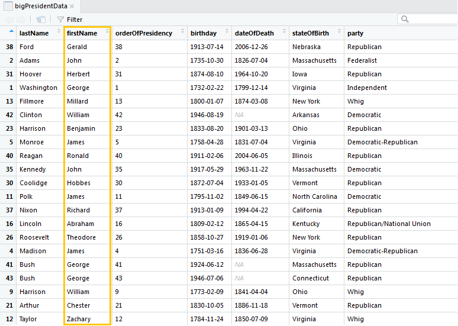
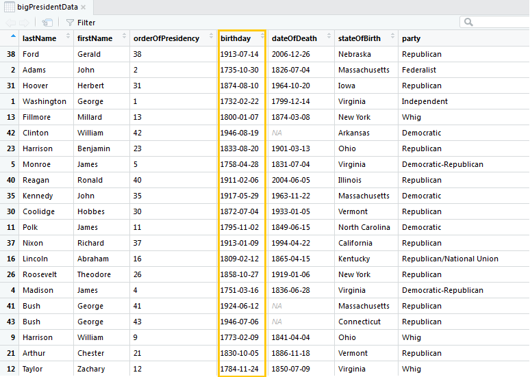
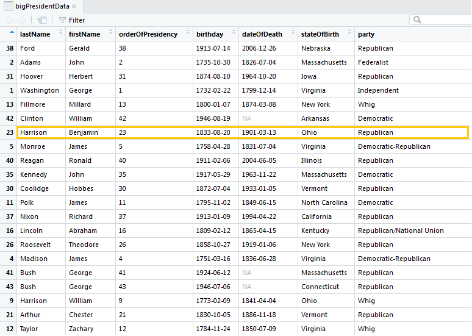

  
```{r setup, include=FALSE}
#library(knitr)
options(htmltools.dir.version = FALSE, cache=TRUE)
#opts_chunk$set(dev.args=list(bg="transparent"), fig.width=15, fig.height=7)
source("kutheme.R")

library(dataMaid)
library(assertr)
library(dplyr)
library(validate)
data(bigPresidentData)
bpD <- bigPresidentData
```

##Row-wise or column-wise checks?

```{r colrow1, echo=FALSE, out.width="70%", fig.align = "center"}

```

---

##Row-wise or column-wise checks?

```{r colrow2, echo=FALSE, out.width="70%", fig.align = "center"}

```

---

##Row-wise or column-wise checks?

```{r colrow3, echo=FALSE, out.width="70%", fig.align = "center"}

```

---

##Row-wise *and* column-wise constraints!
  
* `dataMaid` performs class dependent checks for each variable in a dataset, one at a time (column-wise)
  + Pros: Easy to document what was (not) done, let's you get started without a lot of prior knowledge, easy to share with collaborators
  + Shortcomings: Generally cannot detect internal consistency issues or use non-class dependent variable constraints

---

##Row-wise *and* column-wise constraints!

An R-packages that performs row-wise checks: `validate`

```{r}
library(validate)
```

Note: Different use of the term "validation" - no longer about format, type and range, but used as synonym to "check". 

---

##`validate` - overview:

* Splits checking into two steps:
  1. Define the checking rules in a `validator` object, using the `valdiator()` function.
  2. Confront the data with the rules in a call to `confront`, thereby obtaining a `confrontation` object.
* Easy to asses what problems were found and to document what was checked (saved in `validator` object). 
*  <span style="color:red">Beware: Non-standard object storage might cause trouble!</span>   

---

###Make `validator` object

.footnotesize[
```{r}
val1 <- 
 validator(
   ageAtDeath := floor((dateOfDeath - birthday)/365.25),  
   `Adult president` = ageAtInauguration >= 18,
   `Alive at inauguration` = ageAtDeath >= ageAtInauguration,
   `Positive first name` = firstName*2 > firstName,
   `Death by assassination` = 
     if (dateOfDeath == presidencyEndDate) 
       assassinationAttempt == 1
)
``` 
]

---

###Confront data with `validator` object:
.footnotesize[
```{r}
con1 <- confront(bpD, val1)
summary(con1)[, 1:6]
``` 
]

---

##Understand confrontation results

Lots of functions available for inspecting confrontations:
* `summary()`: Overview of confrontation results
* `aggregate()`: Compute percentage pass/fail/na 
* `sort()`: Sort results by problem prevalence
* `values()`: For each observation and each check: `TRUE`/`FALSE`/`NA`
* `barplot()`: Visual overview of check results
* `errors()`: What errors were caught?
* `warnings()`: What warnings were caught?

---

##Warning: modify-by-reference

* `validator` and `confrontation` objects imply use of "modify-by-reference" rather than "copy-on-modify" semantics (standard R)
* Other package that uses "modify-by-reference": `data.table`
* If one is not aware of modify-by-reference, it can have problematic consequences 
  + Unintentional overwriting of full objects, attributes or parts
  + Caching in rmarkdown does not work (but throws no errors)


---


##Warning: modify-by-reference

```{r}
v1 <- validator(check1 = sex == "Male")
v1

v2 <- v1  
names(v2) <- "All males"
v1
```


---


##Warning: modify-by-reference

Make a copy using `[TRUE]`:
```{r}
v1 <- validator(check1 = sex == "Male")
v2 <- v1[TRUE]  
names(v2) <- "All males"
v1
``` 

