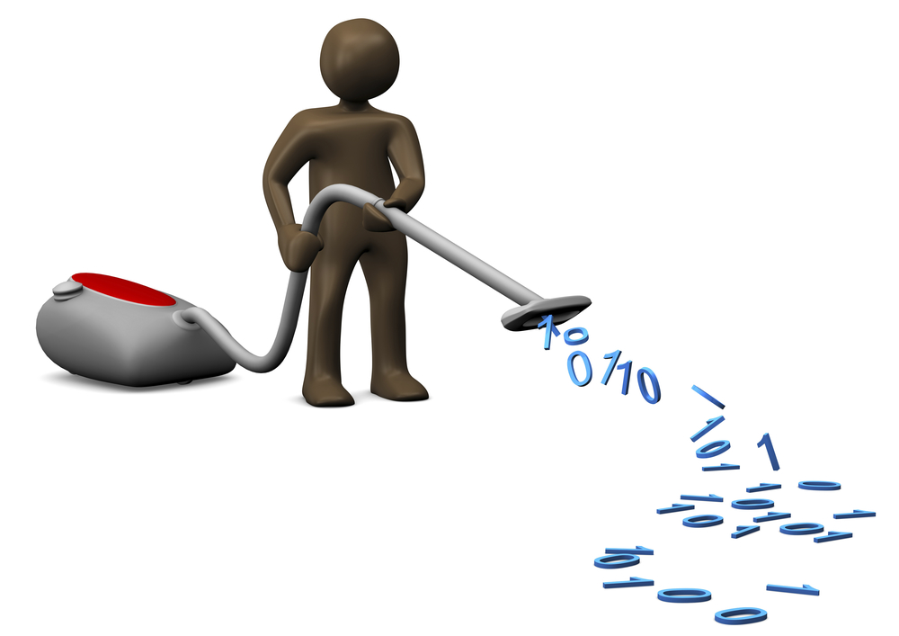

```{r setup, include=FALSE}
library(knitr)
options(htmltools.dir.version = FALSE, cache=TRUE)
opts_chunk$set(comment = NA, prompt=TRUE)
#opts_chunk$set(dev.args=list(bg="transparent"), fig.width=15, fig.height=7)
source("kutheme.R")
library(dataMaid)
toyData <- as.data.frame(toyData)
```

#Summarizing the errors

* What did we find so far?
* What didn't we find?


---


#Data cleaning


```{r cleanpic, echo=FALSE, out.width="60%"}

```

.pull-right[Not the best term ... and should not be unsupervised]


---


#Data cleaning in R

In an R-script:

1. Make a copy of the dataset. 
2. Use indexing to locate the problem in the data.
3. Overwrite the faulty value with a correct one - if you know it - or `NA` to mark that information is missing in this spot. 
4. Save the copy of the "cleaned" data in a **new** file.


---


#Selection - rows/observations

Two systems for selecting observations in `data.frame`s in R: 
By index (row number) or using a logical vector.

```{r}
(tD <- head(toyData, 3))  
``` 

---

#Selection - rows/observations

Four equivalent ways to get the second line of `tD`:
```{r, eval = FALSE}
tD[2, ] #indexing
tD[c(FALSE, TRUE, FALSE), ] #manual logical vector 
tD[tD$id == 2, ] #informative logical vector
tD %>% filter(id==2)  # Using tidyverse
``` 

```{r, echo = FALSE}
tD[tD$id == 2, ] #informative logical vector
```


---


#Selection - rows/observations

Use informative logical vectors as much as possible!

```{r}
tD

#Mark non-positive change as missing:
tD[tD$change > 0, "change"] <- NA
``` 

---

#Selection - columns/variables

*ALWAYS* use variable names.

```{r, eval = FALSE}
#readable, informative code:
tD[tD$change > 0, "change"] <- NA

# Indexing by numbers easily becomes 
# a source of error by itself:
tD[tD$change > 0, 4] <- NA
``` 

---

class: inverse

# Exercise 4

Correct the errors you have found so far.

Make sure to make the cleaning process reproducible.

Remember **rules 1 and 2**!


---

background-image: url(pics/structure.png)
background-size: 30%


## Finishing up

Should now have<br>
a cleaned dataset<br>
that can form the<br>
basis for future<br>
analyses.<br>

With documentation<br>
of how we got<br>
there!

---

# Create codebook

Produce a summary document for subsequent analyses.

.footnotesize[
```{r eval=FALSE}
makeCodebook(bigPresidentData)
```
]

Add label (similar to `labelled` package) or extra information

.footnotesize[
```{r}
bPD <- bigPresidentData
attr(bPD$presidencyYears, "label") <- 
  "Full years as president"
```
]

.footnotesize[
```{r}
attr(bPD$dateOfDeath, "shortDescription") <- 
  "Missing means that the person is still alive"
```
]


---

class: inverse 

# Exercise 4b

Create the final codebook with additional information about some of the variables.

```{r eval=FALSE}
makeCodebook(myCleanedData)
```

---

class: middle, center

# Thank you!

Please grab hold of us here or via email

.pull-left[Anne<br>[ahpe@sund.ku.dk](mailto:ahpe@sund.ku.dk)]  .pull-right[Claus<br>[ekstrom@sund.ku.dk](mailto:ekstrom@sund.ku.dk)]  